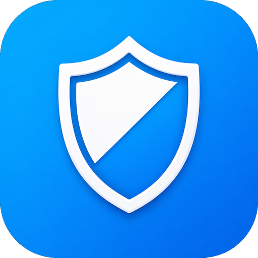
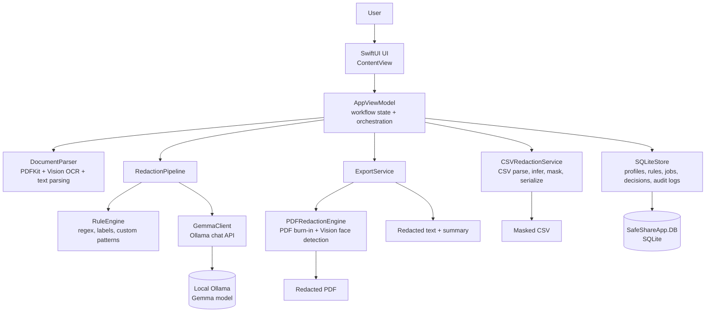

<p align="center">
  
</p>

<h1 align="center">SafeShare Local</h1>

SafeShare Local is a macOS privacy redaction app for preparing PDFs and CSV files before they are shared outside a trusted environment. It runs locally, combines deterministic rules with a local Gemma model through Ollama, gives the user a review step, and exports redacted artifacts such as burn-in PDFs and masked CSV files.

The project is built in Swift and SwiftUI for macOS 14+.

https://www.kaggle.com/competitions/gemma-4-good-hackathon/writeups/safe-share-local

## Why SafeShare Local

Many real-world documents contain sensitive identifiers in messy places: medical PDFs, student/family records, social-service notes, CSV exports, provider signatures, scanned images, and free-text columns. SafeShare Local is designed for workflows where users need a practical local tool that can:

- Detect likely PII and domain-sensitive entities.
- Let a human review, keep, hide, or replace detected values.
- Export files that are safe to share.
- Avoid sending document contents to a hosted API.
- Preserve useful structure in CSV data while masking sensitive cells.

## Current Features

- Native macOS SwiftUI app.
- PDF import with text extraction through PDFKit.
- Apple Vision OCR support in the parser layer for image inputs.
- CSV import, column classification, and masking.
- Profile presets:
  - Medical
  - Student & Family
  - Research / Social Services
  - Custom
- Redaction levels:
  - Basic
  - Medical Safe
  - Family Share
- Hybrid detection:
  - Built-in regex and label-based rules.
  - User-defined keyword or regex patterns.
  - Local Gemma/Ollama model detection.
- PDF review UI with before/after preview.
- PDF burn-in export using black rectangles so hidden text is not selectable in the exported PDF.
- Optional face detection for PDF visual redaction.
- Provider-name and authorizing-provider heuristics.
- CSV masking with:
  - Stable hash tokens for repeatable linkage.
  - GUID tokens for unlinkable replacement.
  - Date/time shifting.
- Local SQLite persistence for profiles, rules, documents, entities, decisions, outputs, and audit logs.
- Local history clear control.

Note: the current UI exposes PDF and CSV import modes. The parser service also contains text and image parsing paths for future workflow expansion.

## Architecture



### Runtime Flow

1. The user chooses PDF or CSV mode.
2. The app imports the file and stores document metadata locally.
3. For PDFs, `RedactionPipeline` runs rule detection and local Gemma detection, then merges overlapping entities.
4. For CSV files, `CSVRedactionService` infers PII columns and optionally asks Gemma to classify columns from headers and sample rows.
5. The user reviews entities or columns in the UI.
6. Export generates the safe artifact:
   - PDF mode exports a burn-in redacted PDF.
   - CSV mode exports a masked CSV.
7. Decisions and output metadata are recorded in SQLite.

## Repository Layout

```text
.
├── SafeShareLocal.xcodeproj              # Xcode project
├── project.yml                           # XcodeGen project definition
├── SafeShareLocalApp/
│   ├── Package.swift                     # Swift Package target
│   ├── Sources/SafeShareLocalApp/
│   │   ├── Core/                         # SwiftUI app entry point
│   │   ├── UI/                           # ContentView, AppViewModel, PDF preview
│   │   ├── Domain/                       # Shared domain models
│   │   ├── Data/                         # SQLiteStore
│   │   ├── Services/                     # Parsing, detection, CSV, export, PDF burn-in
│   │   └── Resources/Prompts/            # Gemma prompt templates
│   └── Tests/                            # XCTest smoke tests
├── SafeShareMacApp/                      # macOS app shell and asset catalog
├── scripts/                              # DB helper scripts
├── docs/                                 # Implementation notes and milestones
├── Prompt/                               # Prompt source copies
└── kaggle-docs/                          # Demo media and Kaggle-facing assets
```

## Requirements

- macOS 14 or newer.
- Xcode 16 or newer recommended for Swift 6 projects.
- Swift Package Manager.
- SQLite command-line tools for DB inspection scripts.
- Ollama if you want model-assisted detection.

## Local Model Setup

SafeShare Local calls the Ollama chat API by default:

```bash
ollama serve
```

Pull or create the model expected by the app:

```bash
ollama pull gemma3:4b
```

Then run the app with a matching model name if your local tag differs from the default:

```bash
export OLLAMA_MODEL="gemma3:4b"
export OLLAMA_ENDPOINT="http://127.0.0.1:11434/api/chat"
```

The current code default is:

```text
OLLAMA_ENDPOINT=http://127.0.0.1:11434/api/chat
OLLAMA_MODEL=Gemma4:e4b
```

Set `OLLAMA_MODEL` when your local Ollama model uses another tag.

## Database

The app expects a SQLite database named `SafeShareApp.DB` with the SafeShare schema. The runtime search order includes:

- `SAFESHARE_DB_PATH`
- `SafeShareApp.DB` in the current working directory
- nearby parent directories relative to the app/package root

To point the app at a specific database:

```bash
export SAFESHARE_DB_PATH="/absolute/path/to/SafeShareApp.DB"
```

Validate the current database:

```bash
./scripts/safeshare_validate_db.sh
```

The database stores local workflow state only. It includes tables for profiles, categories, documents, text spans, redaction jobs, entities, review decisions, outputs, custom patterns, and audit logs.

## Build and Run

### Xcode

Open the project:

```bash
open SafeShareLocal.xcodeproj
```

Select the `SafeShareLocalMac` scheme and run.

### Swift Package

From the package directory:

```bash
cd SafeShareLocalApp
swift build
swift run SafeShareLocalApp
```

If the app cannot find the database, run with:

```bash
SAFESHARE_DB_PATH="../SafeShareApp.DB" swift run SafeShareLocalApp
```

### Regenerate Xcode Project

If you edit `project.yml` and use XcodeGen:

```bash
xcodegen generate
```

## Testing

Run the smoke tests:

```bash
cd SafeShareLocalApp
swift test
```

The current tests cover:

- Profile enum availability.
- CSV masking for names, dates, and notes.
- Provider-name rule detection.

## Privacy Model

SafeShare Local is intended to keep document processing on the user's machine:

- PDF parsing uses PDFKit locally.
- OCR and face detection use Apple Vision locally.
- Rule detection runs in-process.
- Model detection is sent only to the configured Ollama endpoint, normally `127.0.0.1`.
- SQLite data is stored locally in `SafeShareApp.DB`.

Important: if `OLLAMA_ENDPOINT` points to a remote server, document text and CSV samples will be sent to that server. Use a local endpoint for local-only privacy.

## Limitations

- The app is a review tool, not a legal guarantee of de-identification.
- PDF redaction quality depends on text extraction and coordinate mapping.
- Scanned PDFs and images may need OCR improvements for exact visual mapping.
- CSV free-text columns can contain embedded PII that requires careful review.
- Model detection quality depends on the local model and prompt behavior.
- The repository currently includes a checked-in development database. For public releases, review whether sample databases and demo media should be included.

## Development Notes

- `AppViewModel` is the main workflow coordinator.
- `RuleEngine` should stay deterministic and testable.
- `GemmaClient` should return empty results on local model failures rather than blocking rule-based detection.
- `PDFRedactionEngine` must keep exported PDF redactions burned into page images.
- Keep privacy-sensitive defaults local. Avoid adding hosted network dependencies for document content.

## Roadmap

See [docs/safeshare/milestones.md](docs/safeshare/milestones.md) for milestone notes. The current direction includes stronger OCR mapping, evaluation fixtures, precision/recall reporting, runtime DB migration, and release hardening.

## License

This project is licensed under the Apache License 2.0.
